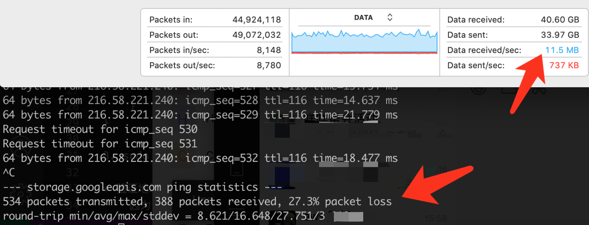

# Accelerate GCS Upload/Download
Google Cloud Storage Upload/Download Accelerate tool, fully usage of network bandwidth, suitable for BIG FILE or poor network scenario.  
谷歌云存储GCS**大文件**上传下载加速，利用多线程、自动无限分片、短链接快速重试等技术，充分利用网络带宽，适合大文件或恶劣网络传输场景。  
Support Linux, MacOS, Windows environment with Python3.7 or later version

## Performance 性能测试:  
* **Single 100GB Big File 单个大文件100GB**  
**Upload 728MB/s SUSTAINABLE HIGH SPEED** (Read from Local SSD) as below graph. In similar test download 120MB/s(Write Local SSD).   
上传达到了 **728MBytes/s** 稳定速度，达到了Local SSD读取速度的瓶颈。类似的下载测试达到120MB/s。  
Running on GCE N2-8cpu with one Local SSD 375G. This speed has reach the cap speed limitation of one Local SSD.   

  
* As compare, here is the speed of running with gsutil command tool with compose upload feature enabled. **Speed only burst to 100MB/s for 2 minutes and then average lower than 15MB/s**. This is because it keep the same TCP connection for long time, and GCS Network cap the TCP speed.   
作为对比，以下是命令行工具 gsutil 达到的速度，15MB/s  

  
* As compare, here is the spped of Transfer Service On-premises. Speed only **average 40MB/s**  
作为对比，以下是 Transfer Service On-premises 服务达到的速度，40MB/s  


* Under poor performance of Network, e.g. packet lost 20% or even 50%, this tool can still upload/download with sustainable high speed, with multi-threads and fast multi-retry.  
在较差的网络情况下，例如丢包20%甚至50%的情况，利用多线程和快速多次重试，本工具仍可以达到较持续的高速度。见本文最底下的测试截图。    

## How to Run

1. Authentication (Choose one of these three)  认证（三选一）
 - Running on GCE(VM): Config IAM Service Account for GCE. GCE API access scope should have at least Storage and oauth API. You can allow all API access scope and only control auth by IAM.  
 如果运行在GCE虚拟机: 则配置IAM Service Account给GCE，并且GCE的访问API权限至少要有Storage和oauth两个API权限（可以全打开，只由IAM控制）
   
 - Running on local PC, you have configured gcloud command line tool, have init the gcloud and authoried . The PC can run gstuil.  
 在本地电脑运行，并曾经配置过gcloud命令行，并进行了初始化和认证，可以运行gsutil的环境  
   
 - General way: Download Json key of IAM Service Account, and config OS Environment point to the key file  
 通用方式: 在IAM Service Account下载Json Key，并配置环境变量指向这个Key文件  
 Document 文档: https://cloud.google.com/docs/authentication/production
```
    export GOOGLE_APPLICATION_CREDENTIALS="/home/user/Downloads/my-key.json"  
```
    

2. 安装  
* Install Python >= version 3.7

* Install library  
```
pip3 install -r requirements.txt
```

3. Simple Download Example  
```
python3 x-gcs-transfer.py \
--job_type download \
--local_dir my/local/dir/ \
--bucket my_gcs_bucket_name \
```

Example Download command 下载示例：  
```
python3 x-gcs-transfer.py \
--job_type download \
--local_dir /Users/hzb/Downloads/test_folder \
--bucket lab-hzb-us-central1 \
--prefix x-gcs-upload/
```
Example Upload example command 上传示例：  
```
python3 x-gcs-transfer.py \
--job_type upload \
--local_dir /Users/hzb/Downloads/test_folder \
--bucket lab-hzb-us-central1 
```
Example Download with custom concurrent and chunksize 上传并自定义并发数和Chunksize：  
```
python3 x-gcs-transfer.py \
--job_type upload \
--local_dir /Users/hzb/Downloads/test_folder \
--bucket lab-hzb-us-central1 \
--prefix x-gcs-upload/ \
--max_concurrent_files 3 \
--max_concurrent_threads_per_file 10 \
--chunksize 20
```
Example Upload one file example command 上传单个文件示例：  
```
python3 x-gcs-transfer.py \
--job_type upload \
--local_dir /Users/hzb/Downloads/test_folder/sing.zip \
--bucket lab-hzb-us-central1 \
--prefix smfile \
--single_file true
```
Example Download one file example command 下载单个文件示例：  
```
python3 x-gcs-transfer.py \
--job_type download \
--local_dir /Users/hzb/Downloads/test_folder/ \
--bucket lab-hzb-us-central1 \
--prefix smfile/sing.zip \
--single_file true
```

4. Advanced parameters  高级选项  

--job_type  
Required: download | upload  

--local_dir  
Required: Local disk directory  

--bucket  
Required: GCS bucket name  

--prefix  
Optional: prefix in the the GCS bucket.  
Default: "/"  

--single_file  
Option: download/upload a directory(False) or just a single file(True).  
Default: False 

--temp_prefix  
Optional. the temp prefix in the bucket for temp chunk files, temp files will be delete after upload and compose complete.  
Default: "x-gcs-temp"  

--max_concurrent_files  
Optional. Concurrent files transfering.  
 Default: 3  

--max_concurrent_threads_per_file  
Optional. Concurrent threads for each file.  
Default: 5  

--conn_timeout  
Optional. TCP connect setup timeout.  
Default: 5  

--read_timeout  
Optional. Response from server timeout, i.e. chunk transfer time.  
Default: 30  

--max_retry 
Optional. Retries on single request of upload/download.  
Default: 300  

--chunksize  
Optional. Chunk size, INT, Unit MB.  
Default: 5

## Notice:
* 并发数：注意并发数不是越多越好，因为网络上会对TCP链接时间长的降速，所以并发过多反而会更慢，总线程数在15比较合适。另外受限于 google-cloud-storage Python library 的限制，目前不能自定义connection pool大小。    
* 服务器内存：max_concurrent_files x max_concurrent_threads_per_file x Chunksize 是传输过程中需要占用的临时内存数，注意服务器的内存配置。  
* 超时设置（conn_timeout, read_timeout）：网络质量差的时候Chunsize可以设置小一点，例如默认的5MB，timeout可以设置得长一些，例如(6, 60)。网络较好可以设置Chunksize大一些，例如10MB或者20MB，timeout可以设置得短一些，例如(3, 10)  

## 实现中国大陆较稳定地网络访问GCS
### 说明
国内访问GCS如果搭建Proxy的方式来大量传输数据并不稳定，带宽上不去。
1. 实际上国内访问storage.googleapis.com是通的，可以通过一个HK的服务器 nslookup 可以找到一些GCS的HK IP地址，丢包率相对低些。实际上，有一个GCS地址通就行，跟bucket在哪里是没关系的。  
2. 访问GCS还必须通过认证地址 oauth2.googleapis.com，这个在大陆是不通的，需要搭建一个Nginx 做TCP 443转发oauth2 api。
3. 在本地服务器host上设置两条记录 
```
sudo vi /etc/hosts
    <Specified_GCS_IP> storage.googleapis.com
    <mynginx_IP> oauth2.googleapis.com
```

### Nginx 安装 (debian为例)
1. 执行
```
sudo apt install nginx -y
mv /etc/nginx/nginx.conf /etc/nginx/nginx.conf.bak
sudo vim /etc/nginx/nginx.conf
```
2. 拷贝以下配置nginx.conf，并保存退出
```
load_module /usr/lib/nginx/modules/ngx_stream_module.so;
events {
        worker_connections 768;
        # multi_accept on;
}
stream {
    server {
        listen 443;
        proxy_pass oauth2.googleapis.com:443;
    }
}
```
3. 重新加载Nginx配置
```
sudo systemctl reload nginx
```
4. 检查Nginx状态
```
sudo systemctl status nginx
netstat -ntulp |grep 443
```

* Under poor performance of Network, packet lost as 20% or even 50%, this tool can still upload/download with sustainable high speed.  
在中国大陆跨境网络比较恶劣的情况下，丢包率达到20%甚至50%，对于200Mbps的普通宽带，可以实现较为持续的高速度。  



* 在恶劣网络场景下，还可以启用服务器网络TCP BBR来进一步优化带宽。  

----
Author: Huang, Zhuobin (James)
